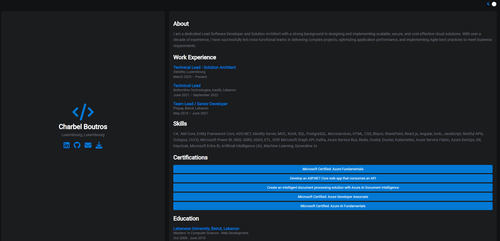

# Portfolio CV Website



## Description

This is a personal portfolio project built with React. It showcases various aspects of my professional background including my personal information, skills, work experience, certifications, and education. The project also features a dark/light theme switch.

## Features

- Responsive design
- Dark and light theme toggle
- FontAwesome icons for social links
- Organized component structure

## Getting Started

### Prerequisites

Ensure you have the following installed:

- Node.js
- npm (Node Package Manager)

### Installation

1. Clone the repository:
   ```bash
   git clone https://github.com/boutroscharbel/portfolio-cv-website.git
   
2. Navigate to the project directory:
   ```bash
   cd your-repo-name
   
3. Install the dependencies:
   ```bash
   npm install

4. To start the project locally:
   ```bash
   npm start
   
5. Open your browser and go to http://localhost:3000 to view the website.
   
7. To create a production build, run:
   ```bash
   npm run build

## Usage

The application features a dark/light theme switch button in the top-right corner. Simply click the button to switch between themes. The theme preference is saved in local storage, so your preference persists across sessions.

### Project Structure

```
.
├── public
│   ├── index.html
│   ├── favicon.ico
│   └── ...
├── src
│   ├── components
│   │   ├── About
│   │   │   └── About.js
│   │   ├── Certifications
│   │   │   └── Certifications.js
│   │   ├── Education
│   │   │   └── Education.js
│   │   ├── Personal
│   │   │   └── Personal.js
│   │   ├── Skills
│   │   │   └── Skills.js
│   │   ├── Work
│   │   │   └── Work.js
│   │   └── ...
│   ├── App.css
│   ├── App.js
│   ├── index.css
│   ├── index.js
│   └── ...
├── .gitignore
├── package.json
└── README.md
```

**Be sure to update the content in the following components:**
1. src/components/About/About.js
2. src/components/Certifications/Certifications.js
3. src/components/Education/Education.js
4. src/components/Personal/Personal.js
5. src/components/Skills/Skills.js
6. src/components/Work/Work.js
   
## Contributing
Contributions and comments are welcome! Please open an issue or submit a pull request for any changes.

## License
This project is licensed under the MIT License.

## Contact
For any questions or suggestions, please reach out to me at:

**LinkedIn**: [Charbel Boutros](https://www.linkedin.com/in/charbel-boutros-32b38272/)

**GitHub**: [boutroscharbel](https://github.com/boutroscharbel)

**Email**: charbel.boutros.dev@gmail.com


